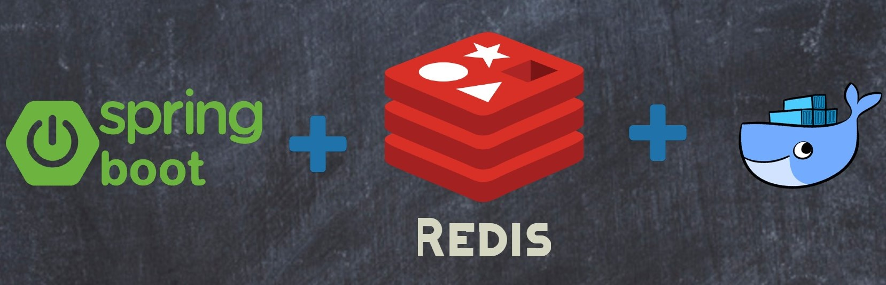

# SpringBoot with Redis as a Cache and database

    - This project demonstrates the implementation of RestApi using Spring Boot 2.7.9 with integration of redis as a cache & database
    - Redis is an open source in-memory data structure store, used as a database, cache and message broker
    - It supports data structures such as strings, hashes, lists, sets, sorted sets, etc
    - One more difference between redis and inmemory cache is that, Redis can evict cached entries based on time-to-live(TTL).
    - Redis is often referred to as a data structures server.
## Redis Cache
    1) Add @EnableCaching to one of your configuration classes. (Preferably the main class which is annotated with @SpringBootApplication)
    2) Add @Cacheable annotation to the methods for which you need to enable caching, Cache the select operation queries. Used with @GetMapping
    3) Optionally, Add an @CacheEvict annotation when you need to Delete the Cache object. Used with @DeleteMapping
    4) Add @CachePut - Update the Cache. Used with @PutMapping
## Requirements
Make sure to have the followings installed:
* To run locally
    - MySQL Server [Installation guide](https://www.mysql.com/downloads/)
    - Redis [Installation guide](https://redis.io/download/)
* To run with Docker
    - Docker (Ubuntu 22.04 [Installation guide](https://docs.docker.com/engine/install/ubuntu/))
    - Docker-compose (Ubuntu 22.04 [Installation guide](https://docs.docker.com/compose/install/)))

## Getting Started
To get started with this project, you will need to have the following installed on your local machine:

* JDK 11+
* Maven 3+
* Redis

## Technologies used
    Java-11
    Spring-boot
    MySQL
    Redis
    Open-API(Swagger)
    Lombok

## Build and Run the project, follow these steps
* Locally
    - Clone the repository: `git clone https://github.com/vikrantcropdata/Rest-API-Radis-Caching-Test-Evaluation-2.git`
    - Navigate to the project directory
    - Create a database in MySql `db_caching`
    - Build the project: `mvn clean install`
    - Run `mvn clean package spring-boot:run` to build the artifact and run the application
    - Run `./elasticsearch` script inside the bin directory of the elastic search package
* Docker
    - Run `docker-compose up --build -d` to run the docker services
## SpringBoot With Redis As a Cache References
1)[Spring Data Redis_Document (Official)](https://docs.spring.io/spring-data/data-redis/docs/current/reference/html/)

2)[Redis Caching Docs (Official)](https://redis.io/docs/manual/client-side-caching/)

3)[Redis OM Spring](https://redis.io/docs/stack/get-started/tutorials/stack-spring/)

4)[Spring Boot cache with Redis](https://medium.com/@MatthewFTech/spring-boot-cache-with-redis-56026f7da83a)

5)[How to implement Redis Cache Using Spring boot?](https://medium.com/javarevisited/how-to-implement-redis-cache-using-spring-boot-c707fcf151a9)

6)[Spring Boot Redis Cache](https://www.digitalocean.com/community/tutorials/spring-boot-redis-cache)

7)[Data Caching in a Spring Boot application with Redis](https://blog.tericcabrel.com/data-caching-spring-boot-redis/)

8)[Using Redis Cache with Spring Boot](https://www.tutorialspoint.com/using-redis-cache-with-spring-boot)

## To Be consider
    - Cacheable objects must be Serializable. The reason is due to how redis stores java objects. The safest way to store objects outside JVM 
      is to write them into serialized bytes. To do that, those classes must implement Serializable.
    - Try not to cache large objects. Even though redis server is separate from application server, large objects in the cache will cause performance issues.
    - Make sure all applications using the same cache are at the same version. Cached objects created by application with the version 
    - A may not be compatible to the applications with the version B. These type of situations will yield unpredictable results which are not good for business.
    - Application restarts don’t affect cache stored in redis.
## Learning
    - Redis can help provide robust cache store with minimal change to your project. 
    - Redis acts as a central cache for all of your instances thus there is no cache 
      poisoning (inconsistent cache values between different servers).